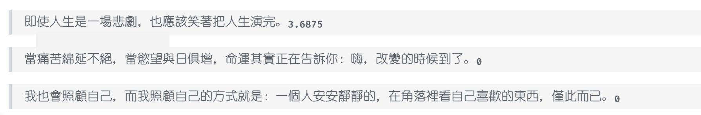
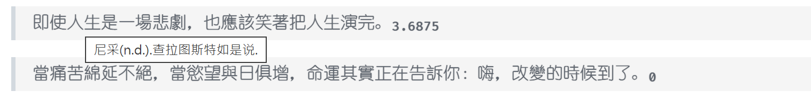
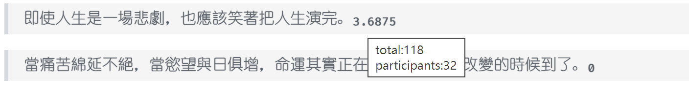
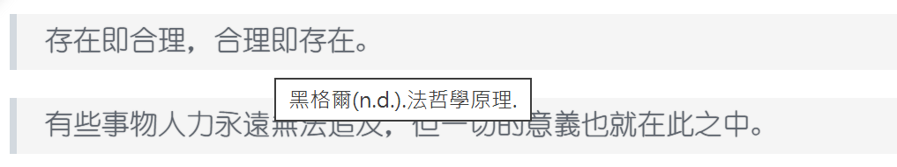

# from-hitokoto-uuid-get-the-text

極簡、純前端、無框架的 TypeScript 小工具。以自訂元素在瀏覽器端把本地文字與 Hitokoto 服務的一言渲染為 `<blockquote>`，在可用時附上評分。無任何執行期相依，產物為多個 IIFE（通常只需引入 `main.js`）。

## Project Name and Description

- 名稱：from-hitokoto-uuid-get-the-text（Hitokoto Renderer）
- 說明：透過兩個自訂元素 `<text-meta>` 與 `<hitokoto-meta>` 各自完成資料解析與渲染。若 `<hitokoto-meta>` 取得有效的登入 token，會抓取指定 UUID 的一言與其評分並渲染。

## Technology Stack

- 語言：TypeScript（嚴格模式）
- 打包：esbuild（format: iife、platform: browser、target: ESNext、sourcemap: true、minify: true）
- 建置：`tsc ./build.mts && node ./build.mjs`
- 套件管理：pnpm（亦可 npm）
- 版本（來自 `package.json`）：
  - typescript: ^5.5.0
  - esbuild: ^0.25.0
  - @types/node: ^24.6.1

## Project Architecture

- 入口與元素註冊：`main.ts` 僅匯入 `./TextMeta` 與 `./HitokotoMeta` 以註冊自訂元素。
- 元素行為：每個自訂元素於 `connectedCallback` 自行渲染；元素本身 `hidden`，渲染結果插在「該元素後方」（不是元素內部）。
- 清理標記：產出的節點會帶 `data-from_uuid` 與 `data-from_index`，便於後續清除或重渲染。
- `<text-meta>` 資料格式（逐行 CSV-like）：`text, from_who, from, cite`。
  - 預設值：`from_who = 「佚名」`、`from = 「未知」`。
  - 轉出：`<blockquote title="${from_who}(n.d.).${from}."><div>{text}</div></blockquote>`；若有 `cite` 則設為 `blockquote.cite`。
- `<hitokoto-meta>`：內容為逗號或空白分隔的 UUID。每個元素各自處理自己的 UUID，並把結果插在「該元素後方」。不會跨元素聚合。

## Getting Started

### Prerequisites

- Node.js 18+（建議）
- pnpm（建議）或 npm

### Install and Build

```powershell
pnpm install
pnpm run build
```

`pnpm run build` 會先用 TypeScript 編譯 `build.mts`，再執行輸出的 `build.mjs`，由 esbuild 產生 `main.js`、`TextMeta.js`、`HitokotoMeta.js` 等 IIFE 產物與 sourcemaps。

### Environment Variables for Hitokoto

登入所需變數：

- `HITOKOTO_EMAIL`
- `HITOKOTO_PASSWORD`

注入來源優先序（見 `HitokotoMeta.ts` 的 `resolveCredential`）：

1. build-time define 常數
2. `globalThis[NAME]`
3. `process.env[NAME]`。

可選 `.env` 範例（`build.mts` 會讀取）：

```dotenv
HITOKOTO_EMAIL=your-email@example.com
HITOKOTO_PASSWORD=your-password
```

任一值缺失時，會跳過遠端一言流程（仍會渲染本地 `<text-meta>`）。

### Use in HTML

在靜態頁引入 `main.js`，於文件中放置自訂元素。元素本身會隱藏，渲染結果插在元素後方。

```html
<script src="./main.js" async></script>
<!-- or 只有 hitokoto-meta -->
<script src="./HitokotoMeta.js" async></script>
<!-- or 只有 text-meta -->
<script src="./TextMeta.js" async></script>

<!-- 只有第一列與第二列示意；cite 可留空 -->
<text-meta>
  在遠方，朝陽正好,佚名,未知,https://example.com
  我亦無他，唯手熟爾,韓愈,古文,https://example.com/post
</text-meta>

<hitokoto-meta>
  0d7ef1a8-b8b8-4b3b-b0b2-aaaaaaaaaaaa bbbbbbbb-cccc-dddd-eeee-ffffffffffff
</hitokoto-meta>
```

通常只需引用 `main.js`。

HitokotoMeta:



TextMeat:


## Project Structure

```text
.
├─ .github/
│  └─ copilot-instructions.md     # 專案資料流與變更準則（權威說明）
├─ api/                            # Hitokoto API 回應型別（*.d.ts）
│  ├─ auth_login.d.ts
│  ├─ hitokoto-uuid-score.d.ts
│  └─ hitokoto_uuid.d.ts
├─ build.mts                       # esbuild 腳本（以 tsc 編譯後執行）
├─ build.mjs                       # 由 build.mts 轉譯產生
├─ main.ts                         # 僅註冊自訂元素的入口
├─ TextMeta.ts                     # <text-meta> 的實作
├─ HitokotoMeta.ts                 # <hitokoto-meta> 的實作
├─ main.js / TextMeta.js / HitokotoMeta.js  # IIFE bundles（browser）
├─ package.json                    # scripts 與 devDependencies
├─ tsconfig.json                   # TypeScript 設定
└─ test.http                       # REST 手測範例（login/quote/score）
```

## Key Features

- 自訂元素渲染：每個元素在 `connectedCallback` 自行渲染，沒有全域 orchestrator。
- 插入位置一致：結果插在來源元素「後方」，來源元素 `hidden`；輸出節點附 `data-from_uuid`、`data-from_index`。
- `<text-meta>`：逐行 CSV-like `text, from_who, from, cite`；`from_who=佚名`、`from=未知` 作為預設；`cite` 會套到 `blockquote.cite`。
- `<hitokoto-meta>`：逗號/空白分隔 UUID；逐元素處理，不跨元素聚合；會登入取得 token，再抓句子與評分。
- 評分顯示：`GET .../hitokoto/{uuid}/score` 成功就於 `<div>` 末尾加 `<sub>{average}</sub>`；若回應為「很抱歉，句子不存在或评分未创建」且 `status === -1`，顯示 0。
- 建置產物：IIFE、ESNext、sourcemap、minify；無任何執行期相依，適用靜態頁直接引入。

## Development Workflow

- 指令：
  - `pnpm run build` → `tsc ./build.mts && node ./build.mjs`
- 打包參數：`format: iife`、`platform: browser`、`target: ESNext`、`sourcemap: true`、`minify: true`。
- 認證變數注入：`build.mts` 會從 `.env`/`process.env` 讀取並透過 esbuild define 注入；執行期再由 `resolveCredential` 讀取。
- 變更準則：保持無框架、無 runtime 相依；避免搬移檔案/目錄或引入額外 bundler/runtime。

## Coding Standards

- 僅維護自訂元素渲染流程與插入點規則，不將渲染內容放入元素內部。
- 嚴格沿用資料格式與 title/cite 規則：`title = ${from_who}(n.d.).${from}.`。
- 新增需要 build-time 注入的常數時：
  1. 在 `build.mts` 的 `defs` 加上 key；
  2. 使用處提供 define / globalThis / process.env 三路讀取；
  3. 若為 API 回應，型別放在 `api/*.d.ts`。

## Testing

- 目前無自動化測試。
- 可用 `test.http` 進行手動驗證（登入 / 取得句子 / 取得評分）。
- Smoke test 建議：
  1. 設定 `.env` 的 `HITOKOTO_EMAIL`、`HITOKOTO_PASSWORD`；
  2. 執行 `pnpm run build`；
  3. 在靜態頁引入 `main.js`，確認 `<blockquote>` 與 `<sub>` 依規渲染。
