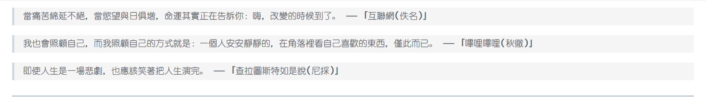
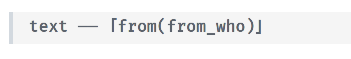

# 一言 (Hitokoto Quote Renderer)

## Project Name and Description

**一個極簡的前端 TypeScript 小工具**，透過自訂標籤 `<hitokoto-meta>` 內放入 Hitokoto 平台([Hitokoto 官網](https://hitokoto.cn)) 的 UUID，程式會：

1. 以帳號密碼取得授權 Token。
2. 逐一呼叫 RESTful API 取得對應 _一言 / 名句_ 的內容。
3. 將結果動態插入為語意化 `<blockquote>` 區塊。

同時，也支援以 `<text-meta>` 標籤批量提供本地靜態文字資料列 (CSV-like，每行一筆) 轉換為同樣格式的區塊。

> 注意：專案根據提供的檔案推斷，原預期存在 `.github/copilot` 與 `copilot-instructions.md` 等文件；目前倉庫中並未找到這些檔案，以下章節若需要更完整資訊以 `TODO` 標示待補。

---

## Technology Stack

| 類別     | 技術                        | 備註                                                     |
| -------- | --------------------------- | -------------------------------------------------------- |
| 語言     | TypeScript (ESNext target)  | 嚴格模式 (`strict`, `noImplicitAny`, `strictNullChecks`) |
| 執行環境 | 現代瀏覽器 (DOM, Fetch API) | 需支援 `fetch` 與 ESNext 特性                            |
| 模組系統 | CommonJS (tsconfig 設定)    | 產出 `main.js` 供瀏覽器引用 (可考慮改 ESM)               |
| API 服務 | Hitokoto RESTful API        | 用於取得句子內容與授權                                   |

> TODO: 若有實際建置工具 (如 Vite / Webpack) 或 CI 配置，補充於此。

---

## Project Architecture

高階架構 (單檔腳本型)：

```text
index.html (或任一靜態頁)
   └── <hitokoto-meta> / <text-meta> (input 容器)
main.ts
   ├── hitokoto_main():
   │     - 收集 <hitokoto-meta> 內容 (UUID 清單)
   │     - 以帳號密碼呼叫 login 取得 token
   │     - 依序抓取每個 UUID 的句子，動態插入 <blockquote>
   └── text_main():
            - 解析 <text-meta> 每行 CSV-like 格式
            - 轉換為 <blockquote>
   (啟動) text_main() → hitokoto_main()
```

資料流：`<hitokoto-meta>` / `<text-meta>` → 解析/分割 → (遠端 API 呼叫或直接映射) → 動態 DOM 生成 `<blockquote>` 插入。

> TODO: 若未來新增打包流程、模組拆分或快取策略，可在此補充。

---

## Getting Started

### 1. 取得程式碼

```bash
git clone <YOUR_REPO_URL>
cd <repo>/web/public/一言
```

### 2. 設定授權帳密（環境變數注入）

已移除程式碼中硬編碼帳密。請透過環境變數在 build 階段注入：

1. 複製 `.env.example` 為 `.env`，並填寫：

   ```dotenv
   HITOKOTO_EMAIL=your-email@example.com
   HITOKOTO_PASSWORD=your-password
   ```

2. 安裝依賴並建置：

   ```powershell
   npm install
   npm run build
   ```

3. 產出的 `main.js` 已內嵌 (define) 這兩個常數；瀏覽器端不會外洩原始帳密檔案。

4. 若不想使用 `.env` 檔，可直接在 PowerShell 單次注入：

```powershell
$env:HITOKOTO_EMAIL="your-email@example.com"; $env:HITOKOTO_PASSWORD="your-password"; npm run build
```

> 安全建議：
>
> - `.env` 不應提交版本庫（已於 `.gitignore`）。
> - 建議使用專用低權限帳號或後端代理 Token。
> - 若未設定環境變數，`hitokoto_main()` 會輸出警告並跳過呼叫。

### 3. 建置

本專案現在使用 `esbuild`：

```powershell
# 安裝依賴（首次）
npm install

# 讀取 .env 並打包 main.ts → main.js
npm run build

# 監看模式（自動重新打包）
npm run dev
```

### 4. 在 HTML 中嵌入標籤

```html
<hitokoto-meta hidden>
  49eff9ca-7145-4c5f-8e62-d3dca63537fa a3891563-f09b-41c9-ac26-d98cf1045eb6
  9e9ada85-111e-475a-8b96-3771df547b96
</hitokoto-meta>

<text-meta hidden> text,from,from_who,cite </text-meta>

<script src="./main.js"></script>
```

### 5. 開啟頁面

直接用瀏覽器開啟該 HTML。載入後會動態插入 `<blockquote>`。

### 6. 輸出範例

```html
<blockquote cite="cite 或 hitokoto 來源 URL">
  <div>句子內容 —— 「出處(作者)」</div>
</blockquote>
```

---

## Project Structure

| 路徑                        | 說明                                          |
| --------------------------- | --------------------------------------------- |
| `main.ts`                   | 核心 TypeScript 腳本，包含解析與 API 取用邏輯 |
| `main.js` / `main.js.map`   | 編譯輸出與 SourceMap                          |
| `image.png` / `image-1.png` | 使用說明截圖                                  |
| `tsconfig.json`             | TypeScript 編譯設定 (啟用嚴格模式)            |
| `README.md`                 | 本文件                                        |

> TODO: 若有上層或其他工作區資料夾結構，補充更完整的層級圖。

---

## Key Features

1. Hitokoto UUID 批次解析與自動渲染。
2. 自訂 `<hitokoto-meta>` / `<text-meta>` 作為輕量輸入介面，避免額外 JSON / 後端部署。
3. 以授權 Token 單次登入後重複使用，提高 API 呼叫效率。
4. 容錯：若 `from` 缺失則顯示 `无名氏` (可國際化擴充)。
5. 可同時處理遠端 (UUID→API) 與本地靜態文字清單。

> TODO: 加入錯誤提示 UI、快取策略、重試/backoff、國際化 (i18n) 等加值功能。

---

## Development Workflow

目前倉庫未提供 `.github` 或自動化流程。推測開發流程為：

1. 直接編輯 `main.ts`。
2. 手動以 `tsc` 編譯 (或使用 IDE 自動編譯)。
3. 在靜態頁面中載入 `main.js` 驗證。

建議可新增：

- `npm init` 並加入 script：`build`, `dev`。
- 以 Vite 快速本地熱載入。
- GitHub Actions：型別檢查 + 壓縮產物 (若規模成長)。
- 自動掃描 `<hitokoto-meta>` 更新差異。

> TODO: 實際分支命名策略 / PR 流程文件。

---

## Coding Standards

未檢出正式 coding guideline 文件，以下為從 tsconfig 推斷：

- 使用嚴格 TypeScript：`strict`, `noImplicitAny`, `strictNullChecks` 等。
- 以功能導向的小函式 (目前兩個主函式)；可考慮：
  - 將 DOM 查找與資料解析分離。
  - 將 API 呼叫封裝 (e.g. `fetchHitokoto(uuid, token)`).
- 命名：目前偏小駝峰；常數/型別尚未獨立。

建議補充：ESLint + Prettier 設定、commit message 規範 (Conventional Commits) 及安全憑證外部化策略。

---

## Testing

未發現測試檔案或框架設定。

建議：

1. 抽象出解析函式供單元測試，如：`parseHitokotoMeta(raw: string): string[]`。
2. 使用 Vitest / Jest 測 parse 與字串組裝邏輯。
3. 以 Playwright / Cypress 做端對端：驗證 `<blockquote>` 正確生成。
4. 模擬失敗情境：登入失敗、UUID 不存在、API 逾時。

> TODO: 建立 `tests/` 目錄與最小測試樣板。

---

## Contributing

歡迎提交 Issue 與 Pull Request。

請在提出 PR 前：

1. 確認 TypeScript 可以成功編譯 (無 `tsc` error)。
2. 避免提交真實帳號密碼；使用假資料或改成可注入設定。
3. 若新增功能，請在 README Key Features 或 TODO 區塊同步更新。
4. 若新增型別檔或重構，請保持嚴格模式不放寬。

建議未來加入：

- CODEOWNERS / PR 模板。
- ESLint + Prettier pre-commit hook (Husky)。
- 安全掃描 (避免將憑證硬編碼提交)。

---

## Security Notes

目前已改為在 build 階段以環境變數注入，不再硬編碼帳密：

- 避免憑證直接出現在原始碼。
- 可藉由不同部署環境 (.env / CI secrets) 輕易輪替。

後續可強化：

- 使用臨時/短期 Token (後端代理簽發)。
- 增加登入失敗與重試 / backoff 策略。
- 於 CI 加入 secret 檢測（例如 trufflehog）。

---

## Roadmap / TODO

| 項目                  | 狀態 | 備註                   |
| --------------------- | ---- | ---------------------- |
| 移除硬編碼憑證        | DONE | build define 注入      |
| 加入自動化建置 (Vite) | TODO | 快速重載與模組化       |
| 單元測試 + E2E        | TODO | parse & DOM 驗證       |
| 錯誤/重試策略         | TODO | API 失敗通知 & backoff |
| 國際化 i18n           | TODO | 中文/英文/日文等       |
| CI 安全檢查           | TODO | Secrets 檢測與型別檢查 |
| README 英文版         | TODO | 提升國際協作           |

---

## Example Screenshots

下列為使用範例截圖：




---

## Acknowledgements

資料來源：Hitokoto (<https://hitokoto.cn>)

> 若後續補齊 `.github/copilot/*` 及 `copilot-instructions.md`，可再生一次 README 以整合正式架構、工作流程與測試策略。
